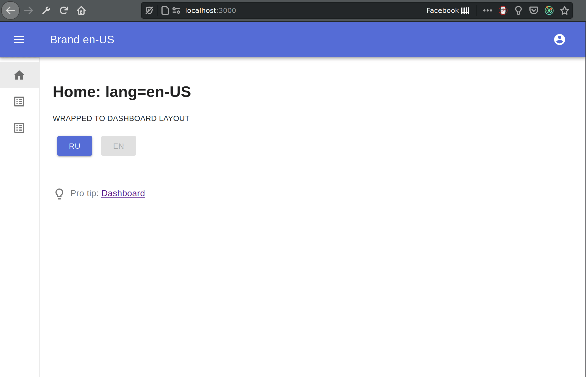

# react-material-admin-boilerplate-2020

## Preview



## Development

> ⚡ Правила наименования веток!  
> `/^(feature|bugfix)\/(TPF)-[0-9]{1,4}/`

### `yarn start`

_Local dev mode_

### `yarn build:local`

_Build to `./build` and move to `../public`_

### `yarn analyze`

_Analyze bundles size_

## Production

### `yarn build`

_Build production to `./build`_

## Что-то еще

### Структура роутов

[@/pages/](/src/pages) по аналогии с Next.js

### API

Для данной реализации рекомендуется fetch, но можно использовать axios. В любом случае, придерживаться правил использовать только общие обработчики в `@/utils/errors`.

Для однообразной проверки успешности запроса, промис должен вернуть универсальный объект типа `{ isOk: boolean, msg?: string, response?: any }` (см. [@/store/sagas/example-fetchTestData](/src/store/sagas/example-fetchTestData.ts))

## Roadmap

- [x] App structure (dev & building like CRA)
- [x] Stack scaffolding
- [x] `postbuild.local.prod.sh`
- [x] Git hooks
- [x] Styled layouts with material design
  - [x] Dashboard layout
    - [x] desktop / laptop / tablet
    - [x] mobile
  - [x] Auth layout
- [x] Test api Docker container
- [ ] Swagger?
- [ ] Error handlers
  - [x] **networkErrorHandler**
  - [x] **httpErrorHandler**
    - [x] fetch
    - [x] axios
  - [ ] **apiErrorHandler** Выясняем, какой ожидать формат ошибок
- [ ] Login
  - [x] **/auth/login** page
  - [ ] Login mechanism
    - [ ] `tokenProvider` hoc
    - [ ] API
  - [ ] Logout mechanism
    - [ ] API
- [ ] Forgot password
  - [x] **/auth/forgot-password** page
  - [ ] API
- [ ] Confirm password
  - [x] **/auth/confirm-password** page
  - [ ] API
- [ ] Create user
  - [x] **/create-user** page
  - [ ] API
- [x] Multilignual support with `react-intl-universal` and Context API
- [x] [Menu levels](#menu-levels)

### menu-levels

```tsx
// @/mui/layouts/dashboard/toolbar-menu.tsx

export interface IToolbarMenuItem {
  path?: string // Required if !sublist, will be as button (not link) if !path
  options: {
    text: string
    noTranslate?: boolean
    icon: JSX.Element
    access?: string[]
    title?: string
  }
  sublist?: IToolbarMenuItem[]
}

const toolbarMenu: IToolbarMenuItem[] = {
  path: '/igatec',
  options: {
    text: 'IGATEC',
    noTranslate: true,
    icon: <WorkIcon />,
    access: ['free'],
  },
  sublist: [
    {
      path: '/igatec/links',
      options: {
        text: 'Links',
        icon: <LinkIcon />,
        access: ['free'],
      },
    },
    {
      path: '/igatec/git-report',
      options: {
        text: 'Git Report',
        noTranslate: true,
        icon: <GitHubIcon />,
        access: ['free'],
      },
    },
  ],
}
```

## Envs

Each env variable should have `REACT_APP_` prefix.

[Like CRA](https://create-react-app.dev/docs/adding-custom-environment-variables/#adding-development-environment-variables-in-env)

Files on the left have more priority than files on the right:

- yarn start: `.env.development.local`, `.env.development`, `.env.local`, `.env`
- yarn build: `.env.production.local`, `.env.production`, `.env.local`, `.env`
- yarn test: `.env.test.local`, `.env.test`, `.env` (note `.env.local` is missing)

## Stack

- React / Redux
- Redux-saga
- SCSS
- Material-UI
